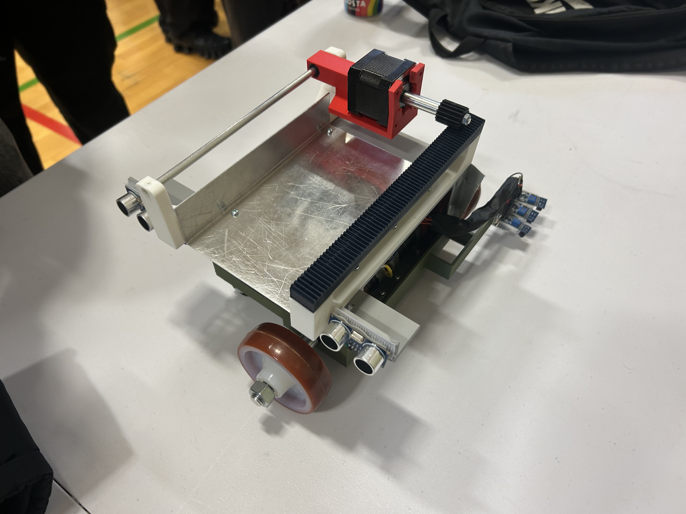
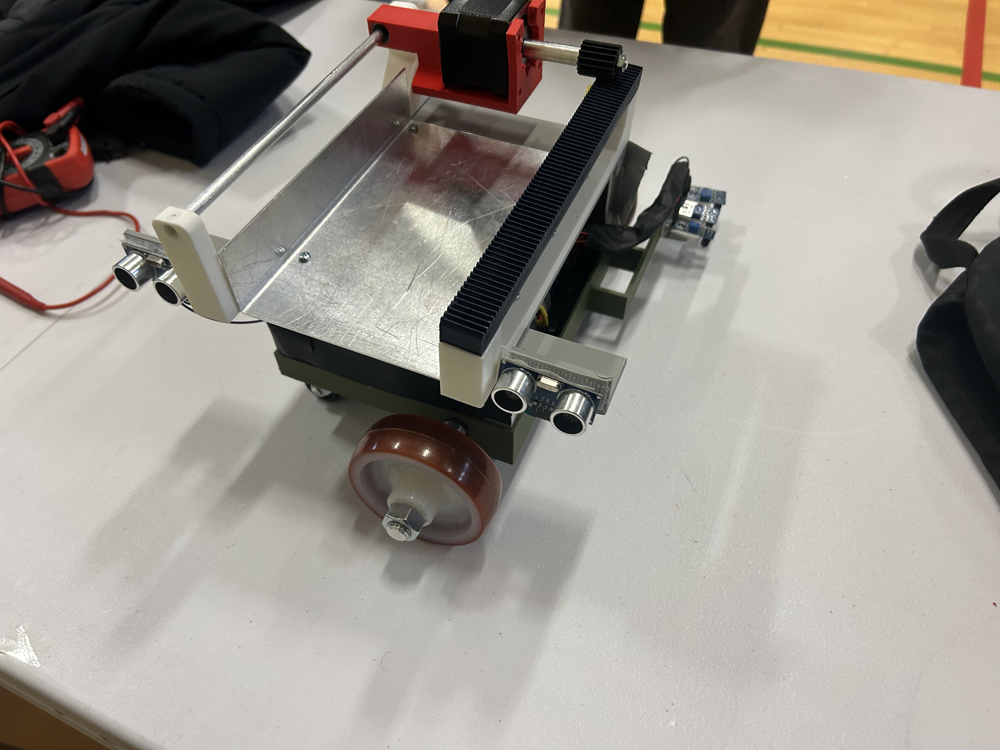
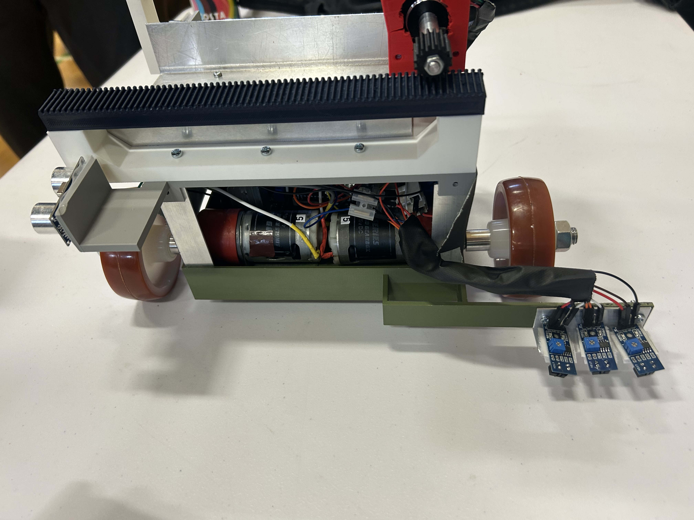

# Surgical Instrument Carrier Robot

**University Team Project — In Progress | 8 members | C/C++, Arduino**

An autonomous robot designed to safely transport surgical instruments within hospital environments. Built to strict constraints: 300×300×400mm envelope, 2kg mass limit, and hospital sterility compliance. Final assembly: 2,041g.

I am the sole software engineer on the team. All embedded firmware was written, structured, and version controlled by me. The mechanical design, electrical wiring, and CAD were handled by other team members.

---

## Photos





---

## System Overview

The control system is built around a **dual-layer finite state machine** managing 4 operational states:

| State | Description |
|---|---|
| `FollowLine` | Continuous 3-sensor IR line following with proportional speed correction |
| `LostLine` | Directional memory recovery — reverses using last known turn direction |
| `ApproachDropoff` | Triggered on front ultrasonic rising edge, robot continues forward |
| `DeliverPackage` | Triggered on rear ultrasonic rising edge, stepper motor actuates delivery rack |

The base layer runs line following continuously. The priority layer monitors for plate detection and overrides state when a valid delivery sequence is confirmed.

---

## Hardware

| Component | Role |
|---|---|
| Arduino Uno Rev 3 | Main microcontroller |
| 4tronix L298N Dual H-Bridge | DC motor driver for wheel control |
| MikroElektronika Stepper 2 Click (A4988) | Stepper motor driver for delivery mechanism |
| TCRT5000 IR Sensors ×3 | Line detection (left, centre, right) |
| HC-SR04 Ultrasonic Sensors ×2 | Plate detection (front and rear) |
| RS PRO DC Geared Motor ×2 | Wheel drive |
| RS PRO Stepper Motor (892-8732) | Delivery rack actuation |
| 11.1V Li-ion Battery (3S) | Power supply |
| DFRobot DC-DC Buck Converter | Voltage regulation |

**Total BOM cost: £244 across RS Components, Rapid Electronics, and university stores.**

---

## Software Architecture

```
Robot_Project_Uni/
├── Robot_Project_Uni.ino   # Main loop — FSM control, plate detection, delivery logic
├── Config.ino              # All pin definitions, tuning constants, global state
├── Types.h                 # State and Action enums
├── Sensors.ino / .h        # IR line sensors, ultrasonic distance measurement
├── Motors.ino / .h         # DC motor control, stepper delivery mechanism
├── Line_Following.ino / .h # Proportional speed correction from sensor readings
│
├── MotorTest/              # DC motor subsystem test
├── SensorTest/             # IR sensor subsystem test
├── ProximityTest/          # Ultrasonic sensor subsystem test
├── StepMotorTest/          # Stepper motor subsystem test
└── IRsensor_Motor/         # Combined IR + motor integration test
```

Each subsystem was validated independently with a dedicated test script before integration.

---

## Key Engineering Decisions

**Proportional-only control over PID**
The robot's speed profile and track geometry didn't require derivative or integral terms. Proportional correction kept tuning straightforward and behaviour predictable under the project timeline.

**Polling over interrupts**
Sensor reading uses polling rather than interrupts. This keeps execution order deterministic and made early-stage debugging significantly easier.

**Rising-edge detection on ultrasonic sensors**
Both front and rear sensors track previous readings. A plate is only registered on a low→high transition, preventing repeated triggers on the same plate. A 2000ms cooldown after each delivery adds a second layer of protection.

**Simulation mode**
`SimMode` in `Config.ino` routes sensor reads to a pre-defined sequence and replaces motor output with Serial prints. This allowed full state machine testing without physical hardware present.

**Hardware abstraction**
Sensor and motor logic is fully separated from state control. The main loop operates entirely through function calls — it has no direct pin access.

---

## Configuration

All tunable parameters are centralised in `Config.ino`:

```cpp
const int base = 150;                        // Base motor speed (0-255)
const float PlateDistanceThreshold = 15;     // Plate detection range (cm)
const unsigned long FrontTimeoutMS = 500;    // Max time between front/rear trigger (ms)
const unsigned long DeliveryCooldown = 2000; // Post-delivery lockout (ms)
const int StepsPerRevolution = 200;          // Stepper steps per delivery cycle
bool SimMode = false;                        // Set true for hardware-free testing
```

No structural code changes are needed for tuning — adjust constants here only.

---

## Running the Project

### Hardware mode
1. Wire components per pin definitions in `Config.ino`
2. Ensure `SimMode = false`
3. Upload `Robot_Project_Uni.ino` via Arduino IDE
4. Open Serial Monitor at 9600 baud for debug output

### Simulation mode
1. Set `SimMode = true` in `Config.ino`
2. Upload and open Serial Monitor at 9600 baud
3. Motor speeds and sensor readings will be printed without any hardware required

### Subsystem testing
Upload individual test sketches from their respective folders to validate each component before full integration.

---

## Project Constraints

| Constraint | Specification | Result |
|---|---|---|
| Envelope | 300×300×400mm | Met |
| Mass limit | 2,000g | 2,041g — *exceeded by 41g* |
| Surface finish | Cleanable, sterile-compatible | Met |
| Budget | £275 | £244 spent |

> **Note on mass:** The 2,041g final assembly slightly exceeded the 2kg specification. This was identified during final integration and documented as a constraint trade-off by the mechanical team.

---

## Status

The robot successfully completed line following and delivery sequences during university demonstration. Active development is ongoing — potential improvements include:

- PID implementation for smoother cornering at higher speeds
- Interrupt-driven sensor reading for reduced latency

---

## Author

**Farhan Ali** — Software Engineer
[GitHub](https://github.com/farhan10904) | [Portfolio](https://pacific-attention-6cd.notion.site/Farhan-Ali-Engineering-Portfolio-2c0495dbdc658028a0decf9447459ea6) | [LinkedIn](https://www.linkedin.com/in/farhan-ali-95047a245/)

*Mechanical design and CAD completed by other team members.*
